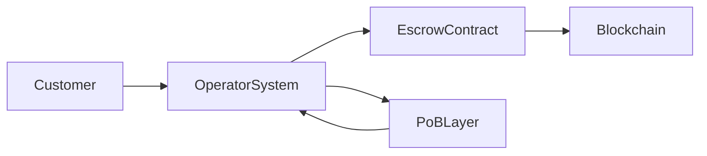

# A Blockchain Payment Infrastructure for Businesses Card Networks Cannot Serve

## Executive Summary

Credit card networks such as Visa and Mastercard were designed to be universal, neutral, and consumer-facing. That design made them extraordinarily successful—but it also created hard limits. Many modern businesses operate outside those limits, not because they are risky or experimental, but because their payment needs conflict with how card networks are structured and regulated.

This platform introduces a different model.

It uses **blockchain smart contracts** for escrow, settlement, and auditability, combined with a **Proof-of-Balance (PoB)** approach that enables **high throughput, scalability, and privacy-preserving transactions**. Unlike traditional blockchains, it does not require every transaction to be globally visible or globally processed.

Most importantly, this platform is **not a payment network**.  
It is **payment infrastructure that businesses can run themselves**, with the business or operator acting as custodian.

This distinction makes it viable for entire categories of businesses that Visa and Mastercard cannot—or deliberately choose not to—serve.

---

## Why Card Networks Cannot Serve Every Business

Visa and Mastercard are constrained by structural requirements:

- They must operate as neutral third parties  
- They must apply uniform risk and dispute rules  
- They must see transaction data to manage fraud  
- They must avoid custody of funds  
- They must comply with global, network-wide regulatory standards  

As a result, there are businesses that are:

- Economically valid  
- Legally permitted at the operator level  
- Operationally sound  

…but **incompatible with card networks**.

---

## High-Level Architecture

---

## Conclusion

The future of payments is not replacing cards everywhere.  
It is **removing cards where they structurally do not belong**.
