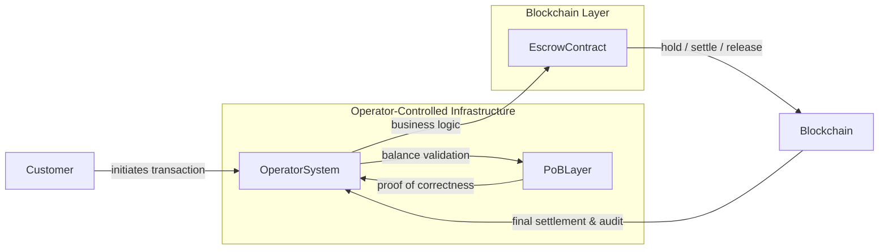
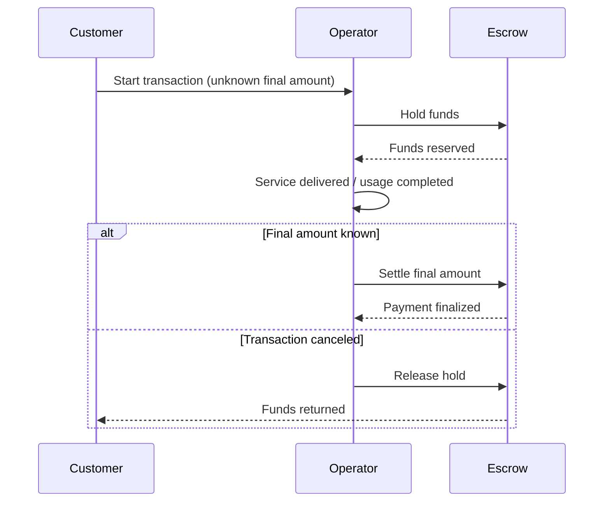
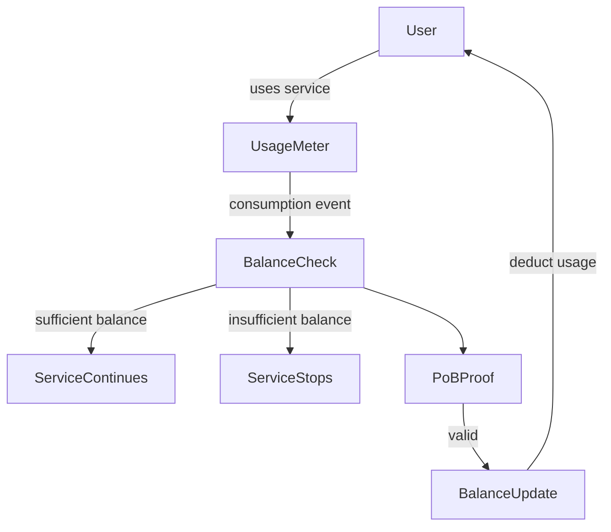
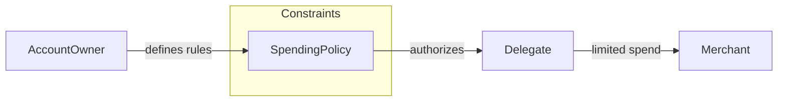
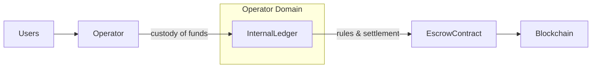
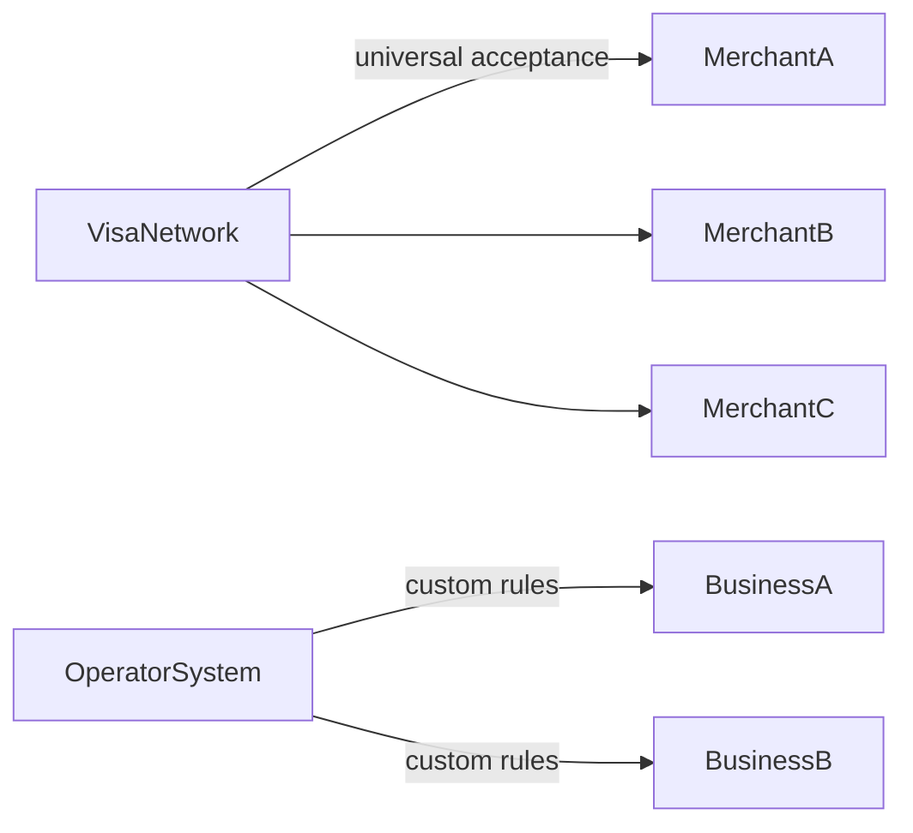

# A Blockchain Payment Infrastructure for Businesses Card Networks Cannot Serve

## Executive Summary

Credit card networks such as Visa and Mastercard were designed to be universal, neutral, and consumer-facing. That design made them extraordinarily successful—but it also created hard limits. Many modern businesses operate outside those limits, not because they are risky or experimental, but because their payment needs conflict with how card networks are structured and regulated.

This platform introduces a different model.

It uses **blockchain smart contracts** for escrow, settlement, and auditability, combined with a **Proof-of-Balance (PoB)** approach that enables **high throughput, scalability, and privacy-preserving transactions**. Unlike traditional blockchains, it does not require every transaction to be globally visible or globally processed.

Most importantly, this platform is **not a payment network**.  
It is **payment infrastructure that businesses can run themselves**, with the business or operator acting as custodian.

This distinction makes it viable for entire categories of businesses that Visa and Mastercard cannot—or deliberately choose not to—serve.

---

## Why Card Networks Cannot Serve Every Business

Visa and Mastercard are constrained by structural requirements:

- They must operate as neutral third parties  
- They must apply uniform risk and dispute rules  
- They must see transaction data to manage fraud  
- They must avoid custody of funds  
- They must comply with global, network-wide regulatory standards  

As a result, there are businesses that are:
- Economically valid  
- Legally permitted at the operator level  
- Operationally sound  

…but **incompatible with card networks**.

When these businesses try to use cards anyway, the result is:
- Forced workarounds  
- Excessive chargebacks  
- Account shutdowns  
- Unclear liability  
- Misaligned regulation  

This platform is designed specifically for those cases.

---

## What This Platform Is (Business View)

At a high level, the platform provides:

- **Blockchain smart contracts** for escrow, settlement, and enforceable business rules  
- **Proof-of-Balance (PoB)** to validate transactions off-chain with high throughput and privacy  
- **Operator custody**, allowing the business itself to hold and manage funds  
- **Closed or semi-closed operation**, where openness is optional, not mandatory  

Blockchain is used **where trust and automation matter**.  
PoB is used **where scale and privacy matter**.

---

## High-Level Architecture (Business Perspective)

---

## Why Proof-of-Balance Matters

Traditional blockchains struggle in real commerce because:

- Every transaction must be globally processed  
- Throughput is limited  
- Costs grow with usage  
- Transactions and balances are transparent by default  

PoB changes this by:

- Validating balance changes without publishing balances  
- Avoiding global transaction ordering  
- Supporting high-frequency, low-value transactions  
- Preserving privacy while maintaining correctness  

For businesses, this means blockchain can finally support **real operational payment flows**, not just settlement.

---

## Tier-1 Business Categories

These categories are not early adopters by preference.  
They are **structurally mismatched with card networks**.

---

## 1) Businesses Where Chargebacks Are Inevitable

### The Problem

Some businesses cannot know the final transaction outcome upfront:
- Fueling  
- Travel and ticketing  
- Hotels and rentals  
- Variable-duration services  

With cards:
- Chargebacks are used for normal behavior  
- Merchants pay fees for expected outcomes  
- Disputes replace workflow logic  

### Why This Platform Fits

Smart contracts provide **native escrow**:
- Funds are held at the start  
- Settlement occurs when the outcome is known  
- Unused funds are released automatically  

PoB allows this to scale without blockchain congestion or public exposure.

### Escrow Flow

---

## 2) Pay-Per-Use and Pay-Per-View Businesses

### The Problem

Consumption-based businesses face:
- Micropayments  
- High transaction frequency  
- Real-time enforcement needs  

Cards and ACH force:
- Credit systems  
- Monthly aggregation  
- Invoicing  
- Credit risk  

### Why This Platform Fits

The platform allows:
- Real-time balance enforcement  
- Usage-based deduction without per-event settlement fees  
- Elimination of credits and invoices  
- Predictable operator economics  

Blockchain ensures correctness.  
PoB ensures scalability.

### Pay-Per-Use Flow

---

## 3) Closed or Operator-Controlled Systems with Shared or Delegated Spending

### The Problem

Cards cannot safely support:
- Shared access  
- Delegated authority  
- Purpose-limited spending  

Once a card is shared:
- Authority becomes unlimited  
- Misuse is inevitable  
- Controls are applied after the fact  

This affects:
- Families  
- Enterprises  
- Fleets  
- Contractors  
- Devices and machines  

### Why This Platform Fits

The platform separates:
- Ownership of funds  
- Spending authority  
- Rules governing usage  

Smart contracts enforce those rules.  
PoB ensures privacy and correctness.

Accounts can be shared **without sharing cards or bank credentials**, and spending can be limited by:
- Merchant  
- Purpose  
- Amount  
- Time  
- Context  

### Delegated Spending Model

---

## 4) Businesses Visa and Mastercard Cannot or Will Not Enter  
*(Regulatory, Structural, or Strategic Exclusion)*

### The Core Issue

There are entire categories of business activity where:
- Card networks cannot take custody  
- Card networks cannot assume liability  
- Card networks cannot apply uniform rules  
- Card networks cannot tolerate regulatory exposure  

This is not about legality in the abstract.  
It is about **network-level constraints**.

Examples include:
- Operator-managed stored-value systems  
- Highly regulated or jurisdiction-specific programs  
- Experimental or emerging business models  
- Bounded economic systems with custom rules  
- Private or membership-based economies  

### Why Operator Custody Solves the Dilemma

This platform allows:
- The **operator or business itself to act as custodian**  
- Funds to remain inside a closed or semi-closed system  
- Regulation to be handled at the operator level  
- Payment logic to match the business model exactly  

Because this is **infrastructure, not a network**:
- There is no requirement for universal acceptance  
- There is no third-party risk transfer  
- There is no mismatch between regulation and operation  

### Operator-Run Custody Model

---

## Why This Is Infrastructure, Not a Payment Network

---

## What All Tier-1 Categories Share

Across all four categories:
- Payment is part of the workflow, not the endpoint  
- Control matters more than acceptance  
- Reversibility must be explicit, not adversarial  
- Privacy is a business requirement  
- Operators want ownership over payment logic  

Card networks are optimized for the opposite assumptions.

---

## Conclusion

The future of payments is not replacing cards everywhere.  
It is **removing cards where they structurally do not belong**.

By combining:
- **Smart-contract escrow**  
- **Proof-of-Balance scalability and privacy**  
- **Operator-run custody**  

this platform makes blockchain viable for real businesses operating beyond the reach—or interest—of card networks.

For Tier-1 businesses, this is not an alternative payment method.  
It is the first payment infrastructure that actually fits how they operate.
